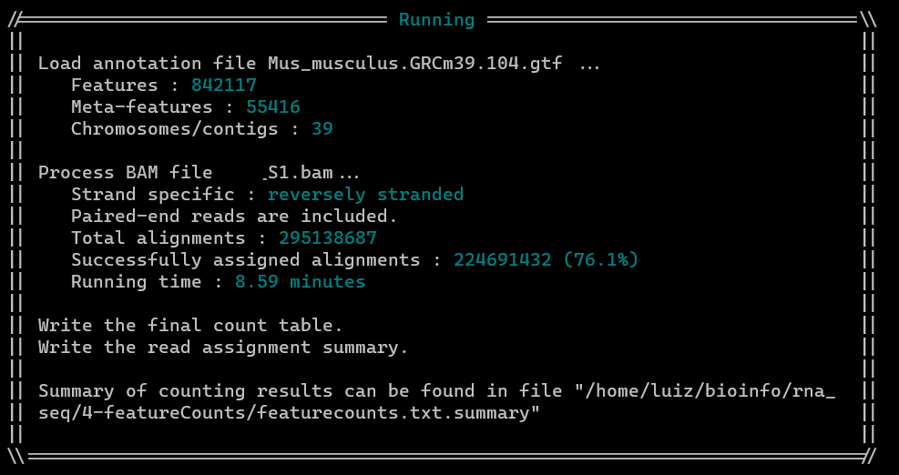

# FeatureCounts

FeatureCounts é um programa leve de contagem de reads, inteiramente na linguagem de programação C. Ele pode ser usado para contar reads 
de gDNA-seq e RNA-seq para características genômicas em arquivos SAM / BAM. FeatureCounts é parte do pacote Subread.

Formatos de entrada:  

* Os arquivos para alinhamentos devem ser fornecidos em Formato SAM ou Formato BAM  

* As anotações para as regiões do gene devem ser fornecidas no formato GFF / GTF:

Esta ferramenta usa os arquivos fornecidos como entrada e gera um arquivo com as "readCounts"  associadas a cada feature (característica) de interesse 
(genes, exons, transcritos, etc.). A estrutura desta matriz de readscounts, possui os genes nas linhas e as amostras representadas nas colunas

Essas são as contagens “brutas” e serão usadas em programas estatísticos para a expressão diferencial de genes.


### Instalando featureCounts

featureCounsts é um subpackage do subread
```bash
conda install -c bioconda subread
```


### Organizando a área de trabalho
```bash
# Criando um novo diretório
mkdir ~/bioinfo/rna-seq/4-featureCounts

# mudando de diretório de trabalho 
cd ~/bioinfo/rna-seq/4-featureCounts

# Copiando os arquivos bam para esse novo diretório
cp ~/bioinfo/rna-seq/3-Alignment_HISAT2/*.bam ~/bioinfo/rna-seq/4-featureCounts

```

### featureCounts sintax:

featureCounts [options] -a annotation_file.gtf -o output_file.txt input_file1.bam input_file2.bam

#### Options:
	-t 'exons' (defualt) _______ especifica quais recursos considerar do gtf. (exon, gene, transcritos)
	-g 'gene_id' (padrão) ______ especifica o tipo de atributo a ser considerado do arquivo gtf. (gene_id, gene_name, p_id, transcript_id, tss_id)
	-T _________________________ especificar o número de threads
	-p ou --countReadPairs _____ Contagem de fragmentos em vez de reads:
	-a _________________________ /path_to_reference_genome/file.gtf
	-o _________________________ /path_and_fileName/featurecounts.txt
	-s _________________________ Realiza a contagem de leitura específica da fita, 0 (unstranded, padrão), 1 (stranded), 2 (stranded reversamente).


#### Observação importante:

* Se o parâmetro de direcionalidade estiver incorreto na etapa de contagem de leituras, as leituras serão consideradas como provenientes da fita errada. 
Isso significa que, no caso em que não há gene na outra fita, não haverá nenhuma contagem e, se houver um gene no mesmo local na outra fita, as leituras
serão contadas para o gene errado.


### Executando featureCounts:

```bash
# Passando o caminho para que todos as arquivos no formato *.bam sejam contabilizados.
featureCounts -T 4 -p -a ~/bioinfo/rna-seq/1-Raw_data/ref_genome/genome_anotation.gtf -o ~/bioinfo/rna-seq/4-featureCounts/featurecounts.txt ~/bioinfo/rna-seq/3-Alignment_HISAT2/*.bam 

# Sem especificar um valor para -p, o programa executa como sendo reads unstranded. Prestar bastante atenção.
featureCounts -T 4 -p -a ~/bioinfo/rna-seq/1-Raw_data/ref_genome/genome_anotation.gtf -o ~/bioinfo/rna-seq/4-featureCounts/counts.txt SRR10493811.sam

# -p 2 diz para os featureCounts que as reads são reversely stranded
featureCounts -T 4 -p -s 2 -a ~/bioinfo/rna-seq/1-Raw_data/ref_genome/genome_anotation.gtf -o ~/bioinfo/rna-seq/4-featureCounts/counts.txt SRR10493819.bam

# Contalibizando todos os arquivos .bam no diretório de trabalho:
featureCounts -T 5 -p -s 2 -a ~/bioinfo/rna_seq/1-raw_data/reference_genome/Mus_musculus.GRCm39.104.gtf -o ~/bioinfo/rna_seq/4-featureCounts/featurecounts.txt *.bam
```

Output featureCouns:



## Referências:

http://subread.sourceforge.net/  
http://subread.sourceforge.net/featureCounts.html
